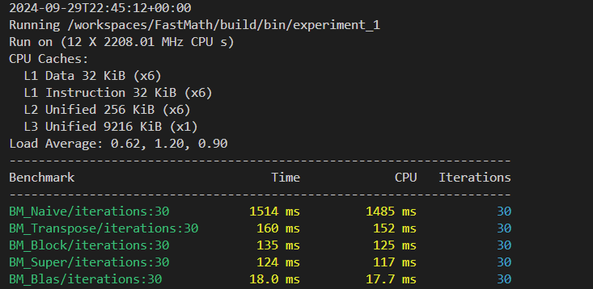

# General Matrix Multiplication Experiment

[Go back](../../../README.md#experiments)

## Problem setup

We have two matrices $A$ and $B$ which are $n \times n$ matrices. Then we perform matrix multiplication to get matrix $C$ and each element of matrix $C$ we calculate in following way:

$$
C_{ij} = \sum_{k=0}^{n}A_{ik}B_{kj} 
$$

Computational bandwith = $O(n^3)$

Memory bandwith = $O(n^2)$

Theoretically given the large $n$ this algorithm will become compute bounded.

## Optimization #1

Naive Gemm implementation loops through rows and columns and calculates given sum. Implementation can be found [here](../../algorithms/gemm.cpp#19). Problem with this implementation is that retrieving values from cache is not optimized. For matrix $a$ cache value retrieval is fine since inner matrix memory is organized in per row basis. But for matrix $b$ values are fetched column by column so CPU needs to jump between memory adresses that are not close to each other. By transposing second matrix we get faster fatching and faster computation even though we have more computation to do (since we first need to transpose the matrix). Implementation can be found [here](../../algorithms/gemm.cpp#34). Static memory is used in order to avoid memory initialization every time. 

Without OpenMP:

With OpenMP:

## Optimization #2 and #3

Optimization #2 includes calculating matrix multiplication by blocks. This way we optimize caching since in case of rows/columns being too big (in our example 1024) they can't fit in cache. So If we choose blocks wher rows and columns can fit we can optimize or caching. 

Optimization #3 includes dedicating local memory for each OpenMP thread which is size of 3 blocks needed to multiply our blocks. Also if we use macro to define block size we get potentionally additional optimization by complier.

And finally BLAS implementation of gemm algorithm is shown for comparison which shows us that "we should not invent hot water" as they say in Balkan countries.

